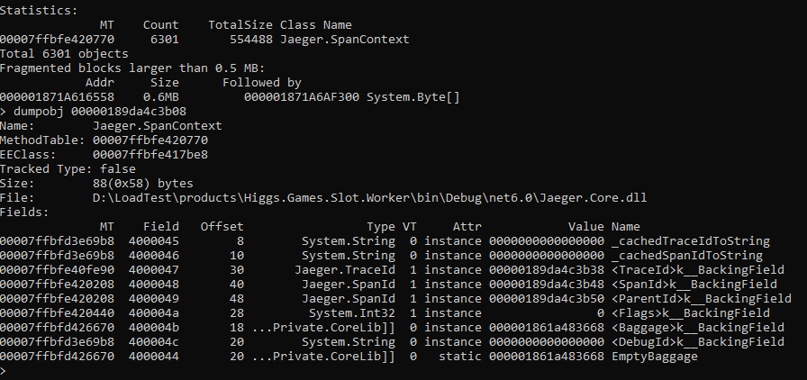
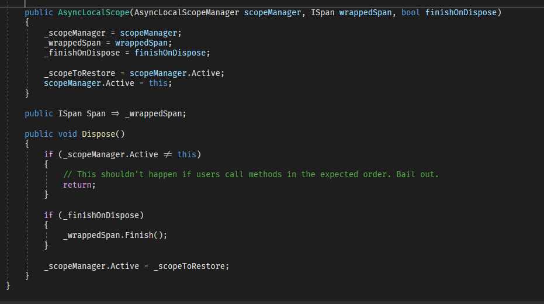

# Debug a memory leak in .NET - Sharing


## Issues


我們的Worker持續有memory leak的問題，大約一個禮拜100mb左右，但因為部屬還算頻繁的關係導致問題不是很明顯，不會到Pod死掉這麼嚴重，但去年世界賽的時候有Code Freezes一段時間沒有部屬，導致這問題又浮現出來，所以就有了這一張單去處理這Issue，在查找的過程中有使用了一些工具和心得，簡單介紹和分享一下

### 適用場景
因為他本身的用途蠻廣的，Application Crash、CPU High、Memory Leak、stack trace等等問題都可以去解，最重要的就是收集Dump檔

## dotnet tools

事前安裝
```
curl -L https://dot.net/v1/dotnet-install.sh -o dotnet-install.sh
chmod +x ./dotnet-install.sh
./dotnet-install.sh -c 6.0 --install-dir /usr/share/dotnet
export PATH=$PATH:$HOME/.dotnet/tools
```
dotnet-counters - 查看目前的Process、monitor Application的資訊
dotnet-dump -產生 dump檔用來Analyze
```
dotnet tool install --global dotnet-counters
dotnet tool install --global dotnet-dump 
```

Find the PID (choose one of the methods):
```
dotnet-counters ps 
supervisorctl status dotnet
```
使用dotnet monitor查看RunTime中的資訊
```
dotnet-counters monitor --refresh-interval 1 -p {pid}
```
例如以這個範例來說，可以看到有非常大量的記憶體停留在Gen2


LOH的Size只有98K左右，GC觸發的頻率也沒有很頻繁
所以大概可以推論是SOH的物件沒有成功被釋放，最後通通堆在Gen2


Generate dump file
```
dotnet-dump collect -p {pid}
```

Analyze dump file
```
dotnet-dump analyze {fileName}
```
查看目前GC的狀態
```
gcheapstat
```


查看目前Manged Heap的整體資訊
```
dumpheap -stat
```
 MT | Count | TotalSize | Class Name


用Method Table Address 尋找物件的位址
```
dumpheap -mt 00007ffbfe420770
```
Address| MT|     Size|

    

列出物件的詳細資訊(Method Table、EEClass、Size、Field。
```
dumpobj {Address}
do {Address}
```



再針對裡面的資訊去追追看
```
dumpheap -mt 00007faddaa50f90
```

可以稍微整理一下這些資訊

拿到MethTable裡面詳細的資訊後
```
dumpobj {Address}
do 000001871a56e810
```

## example code



## 其他工具:

### WinDBG
只在Window上可以用，介面雖然陽春但功能非常強大
可以直接起Application也可以直接Attach到Process觀察
還可以寫JavaScript來Debug

Load進Dump後，需要先下command analyze
```
!analyze -v
!address -summary
```
接著因為指令都差不多就不依依列出
查看 manged heap整體資訊
```
!dumpheap -stat
```
依照methtable找尋所有物件
```
!DumpHeap /d -mt 00007ff01e583970
```

找尋物件位址
```
!DumpObj /d 00007fef7422df30
```
再點Method Table時GUI上的搜尋方式不會列出詳細資訊


```
!DumpMT /d 00007ff01aead2e0
```

改使用SOS的指令
```
!dumpheap -mt 00007ff01aead2e0
```

看到一樣的結果


可以直接使用Script查詢，多了很多操作空間


### DotMemory
可直接分析Dump檔，也可以直接Attach process監控，還能依照條件自動快照
```
apt-get update -y && apt-get install -y wget && \
wget -O dotMemoryclt.zip https://www.nuget.org/api/v2/package/JetBrains.dotMemory.Console.linux-x64 && \
apt-get install -y unzip && \
unzip dotMemoryclt.zip -d ./dotMemoryclt && \
chmod +x -R dotMemoryclt/*
```
get the process ID:
```
dotnet-counters ps 
supervisorctl status dotnet
```

單純取得snapshot
```
./dotMemoryclt/tools/dotmemory get-snapshot 1
```
直接attach到process
```
./dotMemoryclt/tools/dotmemory attach 1
```
取得snapshot
```
##dotMemory["get-snapshot"]
```

get snapshot
```
./dotMemoryclt/tools/dotmemory get-snapshot 1

./dotMemoryclt/tools/dotmemory attach 1
##dotMemory["get-snapshot"]
```


## 工具比較
|                      | Unmanaged Memory | Managed Memory | Attach Process | Snapshot Compare|
|----------------------|------------------|----------------|----------------|-------------------|
| dotnet-dump          | No  | Yes            | No            | No               |
| Visual Studio Profile| Yes              | Yes            | Yes            | Yes               |
| WinDbg               | Yes              | Yes            | Yes            | Yes               |
| dotMemory            | Yes  | Yes            | Yes            | Yes               |


## Summary
過程主要就是收集和分析dump檔
然後又分能不能在Local重現，因為像Vistual studio內建的工具、DotMemory、WinDbg這些工具都有辦法直接attach process，如果一開始有辦法直接在Local測是最好，不行的話就只能Trace到一點蛛絲馬跡之後開始在小範圍測試，如果可以的話能測試到OOM是最好

1. 找到復現的方式，假設Memory沒有任何增長，代表那塊地方沒有memory leak的問題，可以直接排除掉
2. 假設有出現memory的增長很有可能只是GC還沒回收
3. GC有可能已經回收但沒立刻釋放memory，GC內部會把那塊memory標記成可以重新使用，等下次分配使用(為了避免頻繁的記憶體分配和釋放的操作)

後續觀察結果


### Reference

SOS debugger command:
https://learn.microsoft.com/en-us/dotnet/core/diagnostics/sos-debugging-extension?WT.mc_id=DT-MVP-4015686

https://learn.microsoft.com/en-us/dotnet/standard/garbage-collection/large-object-heap

Dotnet tools:
https://learn.microsoft.com/en-us/dotnet/core/tools/dotnet-install-script?WT.mc_id=DT-MVP-4015686
https://learn.microsoft.com/en-us/dotnet/core/diagnostics/?WT.mc_id=DT-MVP-4015686

WinDbg:
https://learn.microsoft.com/en-us/windows-hardware/drivers/debugger/windbg-overview?WT.mc_id=DT-MVP-4015686

dotMemory:
https://www.jetbrains.com/dotmemory/documentation/
https://www.jetbrains.com/help/dotmemory/Getting_Started_with_dotMemory.html

Visualstudio profiling:
https://learn.microsoft.com/en-us/visualstudio/profiling/memory-usage?view=vs-2022


